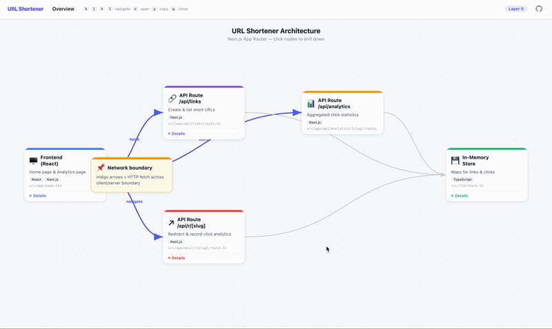

# Layered Flow Chart

A [Claude Code](https://claude.com/claude-code) plugin that creates interactive, hierarchical flow diagrams as single-file HTML with drill-down navigation.

<!-- TODO: Replace with actual demo GIF after recording -->
<!--  -->

## Live Demo

**[View the interactive demo](https://texmeijin.github.io/layered-flow-chart-plugin/)** — a URL Shortener architecture visualized with drill-down layers.

## Features

- FigJam/Miro-like interactive flow chart in a single HTML file
- Click nodes to drill down into deeper detail layers (stacking modals)
- Vim-style keyboard navigation: `h` `j` `k` `l` navigate, `o` open, `y` yank (copy), `q` close
- Network boundary arrows (indigo) to distinguish cross-process connections
- Copy node content as Markdown with `y` key or click the copy button
- 3-mode workflow: **Create** / **Update** / **Refine**
- Multi-phase SubAgent pipeline for thorough code investigation before chart generation

## Installation

### From marketplace (recommended)

```bash
claude plugin marketplace add TeXmeijin/layered-flow-chart-plugin
claude plugin install layered-flow-chart
```

### Manual

Copy the `skills/layered-flow-chart/` directory to `~/.claude/skills/`.

## Usage

Simply ask Claude Code to create a flow diagram:

```
> Make a flow diagram of the authentication module
> Create a layered flow chart of the order processing pipeline
> この機能の処理フロー図を作って
```

The skill automatically:
1. Investigates your codebase using serial Explore SubAgents (broad survey, then deep dive)
2. Converts findings into a structured LEVELS data object
3. Generates a single-file HTML with the interactive chart
4. Opens it in your browser for verification

### Updating an existing chart

```
> Update the flow chart to reflect the latest code changes
> フロー図を最新のコードに合わせて更新して
```

### Refining an existing chart

```
> Add boundary connections to the flow chart
> Improve the layout and add more detail to the API layer
> フロー図のレイアウトを改善して
```

## Examples

The `examples/` directory contains a sample Next.js URL Shortener app with:
- Frontend pages (Home + Analytics dashboard)
- API Routes (create link, redirect with analytics, get stats)
- In-memory store with aggregation functions
- User-Agent parser with 40+ browser/OS detection rules

The [live demo](https://texmeijin.github.io/layered-flow-chart-plugin/) is the flow chart generated from this example app.

## License

MIT
